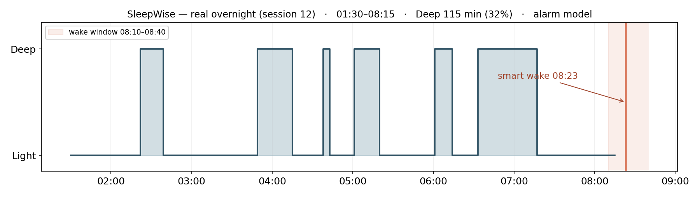

# SleepWise — Android & Wear OS App

Smart sleep alarm that classifies sleep stage **in real time, entirely on-device**,
from a Galaxy Watch, and wakes the user during **light sleep** within a chosen
wake-up window — with a guaranteed fallback alarm if deep sleep never breaks. All
inference runs on the phone, offline; the server is never in the decision loop.

> **Related repositories:**
> - [SleepWise-Backend](https://github.com/Galyaishh/SleepWise-Backend) — FastAPI server (accounts + night history)
> - [SleepWise-Model](https://github.com/afiksoco/SleepWise) — model training, datasets & experiments

---

## Proof — a real overnight

A full night on a Galaxy Watch5 Pro: tracked all night, detected deep-sleep bouts,
held off through them, and **smart-woke on light sleep at 08:23** — inside the
08:10–08:40 window, ahead of the fallback.



*(Alarm model's Deep/Light decision track. The wake decision is on-device; the
window is shaded and the smart-wake moment marked.)*

---

## System Architecture

```
Galaxy Watch (Wear OS)
  └── HrStreamService
        ├── ExerciseClient  → continuous heart rate
        ├── SensorManager   → accelerometer (200 ms)
        ├── Samsung Health Sensor SDK → skin temperature + IBI
        └── every 5 s → MessageClient.sendMessage()  (4 channels)

Android Phone   (all inference here, offline)
  ├── WearMessageListener  ← HR / accel / temp / IBI batches (event-driven, Doze-proof)
  ├── WearHrSource / WearAccelSource / WearTempSource / WearHrvSource  ← rolling 1-hour buffers
  └── SleepMonitoringService
        ├── featuresFromWearSamples() → 45-feature vector (HR + accel + temp + HRV + masks)
        ├── TFLiteSleepPredictor
        │     ├── alarm model   → Deep vs Light   (drives the wake decision)
        │     │     EMA α=0.3 · hysteresis 0.55/0.35 · 3-epoch stability gate
        │     └── report model  → Wake/Light/Deep/REM   (morning hypnogram, display only)
        └── favorable? → AlarmScheduler → AlarmRingService → AlarmRingingActivity
                         (else: guaranteed fallback alarm at window end)

FastAPI backend  → sign-in, night-history sync (not in the wake-decision loop)
```

---

## How the wake decision works

1. **Watch streams 4 signals** in 5-second batches; the phone buffers them.
2. **Per 1-minute epoch**, the phone rebuilds a **45-feature vector** — the same
   feature contract used to train the model, so training and inference match.
3. The **alarm model** (small dense NN → TFLite) outputs a Deep probability.
4. **Stabilisation** (this is what makes it safe to act on): EMA smoothing
   (α=0.3) → dual-threshold **hysteresis (0.55 / 0.35)** → a **3-epoch stability
   gate**. A single noisy minute can't fire the alarm.
5. It fires only when **all four** hold: `insideWindow && fresh (<10 min) &&
   stage == Light && isStable`. Otherwise the **fallback** rings at the window end.

A second **report model** runs on the same feature vector to produce the 4-stage
morning hypnogram — it's display-only and never affects the alarm.

---

## Key code

| File | What |
|---|---|
| [`TFLiteSleepPredictor.kt`](app/src/main/java/com/example/sleepwisepoc/TFLiteSleepPredictor.kt) | Loads **both** TFLite models; rebuilds the 45-feature vector on-device; EMA + hysteresis + stability gate; `predict()` (alarm) and `predictReportStage()` (4-stage report) |
| [`SleepMonitoringService.kt`](app/src/main/java/com/example/sleepwisepoc/service/SleepMonitoringService.kt) | Foreground service; event-driven `runPredictionPass()`; favorable-moment fire logic; Doze-proof AlarmManager backstop; Room persistence + upload |
| [`WearMessageListener.kt`](app/src/main/java/com/example/sleepwisepoc/wear/WearMessageListener.kt) | `WearableListenerService` — receives HR/accel/temp/IBI batches and wakes the prediction pass immediately (pierces Doze) |
| [`wear/…/HrStreamService.kt`](wear/src/main/java/com/example/sleepwisepoc/wear/) | Watch-side streaming — `ExerciseClient` in `WORKOUT` mode (doesn't stop on inactivity) + Samsung Health Sensor SDK for temp/IBI |
| [`AlarmRingService.kt`](app/src/main/java/com/example/sleepwisepoc/alarm/AlarmRingService.kt) | Looping `MediaPlayer` + waveform vibration + screen-bright wake-lock, auto-release |
| `app/src/main/assets/` | `sleep_stage_model.tflite` (alarm) + `report_model.tflite` (4-stage) + metadata |

---

## Build & install

```bash
# JAVA_HOME must be a JDK 17–21 (AGP 8.7). Point ANDROID_HOME at your SDK.
export JAVA_HOME=/path/to/jdk-21
export ANDROID_HOME=$HOME/Android/Sdk

./gradlew :app:assembleDebug
adb install -r app/build/outputs/apk/debug/app-debug.apk
```

**Requirements:** Android SDK 34 · Gradle 8+ · Galaxy Watch (Wear OS, minSdk 30) ·
Samsung Health Sensor SDK (for skin-temp + IBI). Jetpack Compose UI.

---

## On-device models

Both are small dense NNs over the **same 45-feature vector**, trained on 3 pooled
cohorts (Walch + DREAMT + Wearanize+, 120 subjects, 3 devices) with presence masks
so they degrade gracefully when a signal is missing.

| Model | Job | Output | Metrics (grouped 5-fold CV) |
|---|---|---|---|
| **Alarm** | wake decision | Deep vs Light | Deep recall **83%**, Deep precision **~35%**, **Light precision 97%** |
| **Report** | morning hypnogram (display only) | Wake / Light / Deep / REM | overall **67%**, Cohen's κ **~0.48** |

The alarm is tuned for **high Deep recall** — missing deep sleep (waking you in it)
is the failure to avoid; over-calling deep just makes it wait. Full training
pipeline, datasets and experiment ledger: [SleepWise-Model](https://github.com/afiksoco/SleepWise).
